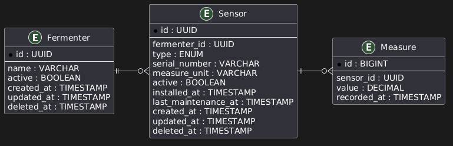

# EH Brewing Monitoring Dashboard

A web dashboard for real-time monitoring of fermentation data across EH Brewing fermenters.

## Overview

EH Brewing operates multiple independent fermenters, each equipped with temperature and density sensors. This project provides a centralized web interface for monitoring fermentation metrics in real time, enabling operators to track process conditions remotely.

## Data Model

The application is structured around three main entities:

1. **Fermenter** - Represents a fermentation tank monitored by the system.
2. **Sensor** - Represents a temperature or density sensor installed in a fermenter.
3. **Measure** - Represents a measurement collected by a sensor at a specific point in time.

### Entity Relationship Diagram



## For Development

Example `appsettings.**.json`:
```
{
    "ConnectionStrings": {
        "DefaultConnection": "Host=localhost;Database=dashboard;Username=postgres;Password=password"
    }
}
```